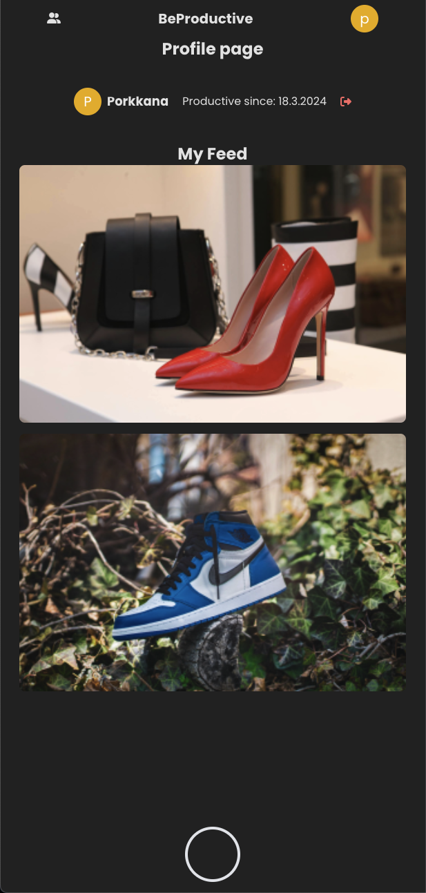
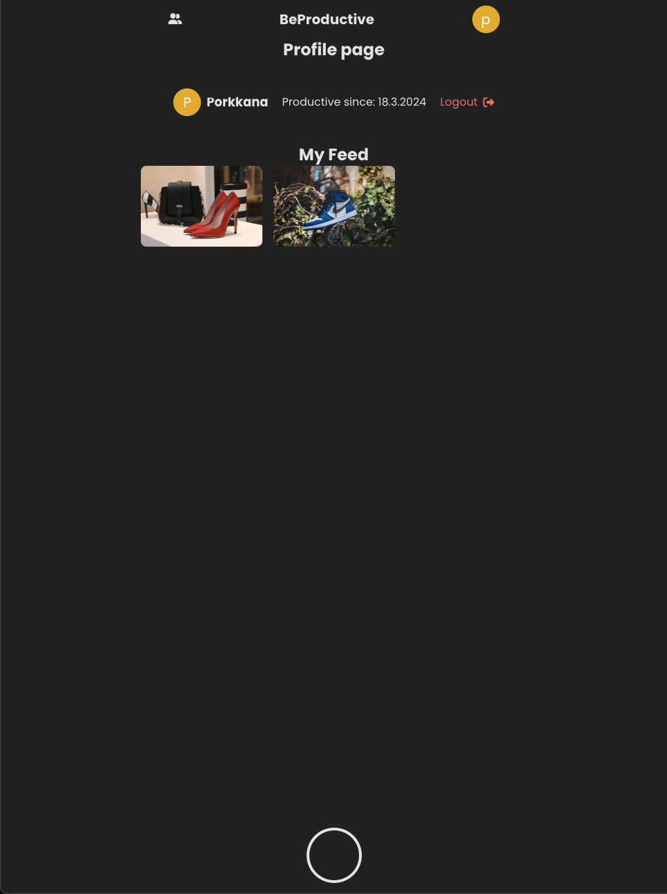
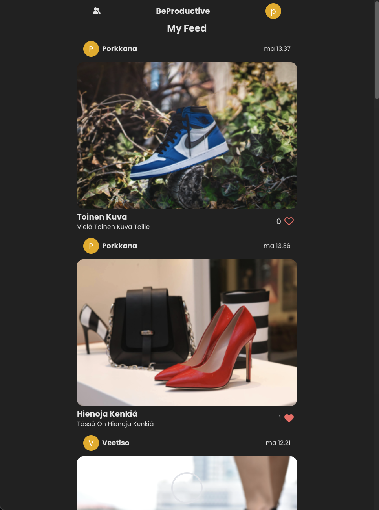
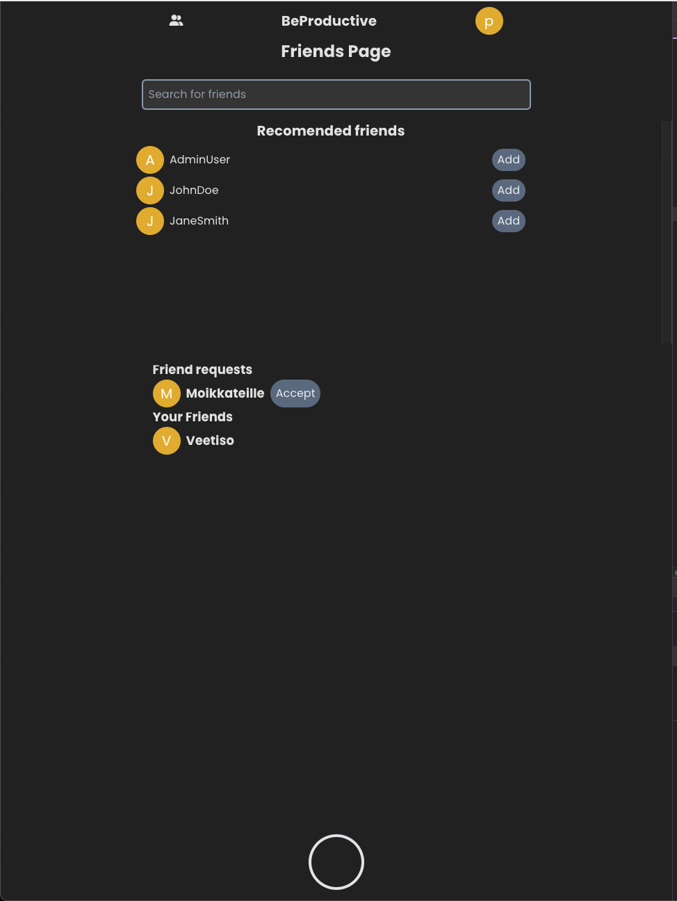
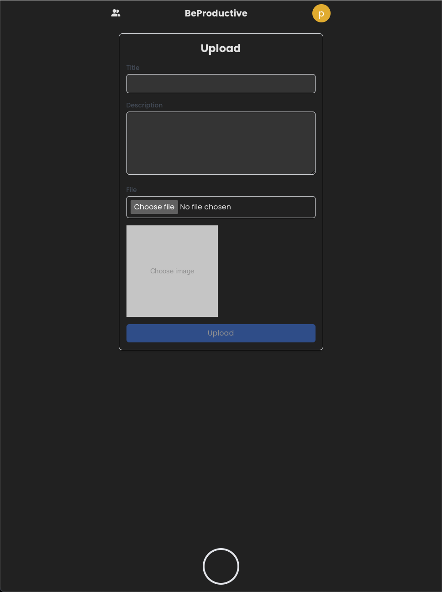

# Hybrid yksilötehtävä frontend

## Link to my app
[Link to app](https://users.metropolia.fi/~veetiso/vuosi3/hybrid/react-2/)

## Link to backend repo
[Link to backend github repository](https://github.com/Vege25/hybrid-servers)

## Link to apidocs
- TODO

## App idea
- Share Productivity with friends and others by posting a daily productive media
## Features in the app:
- Add friends
- View users posts
- View your profile
- Log in
- Register
- Post your own productivity post
- Like a post
- Add a comment to a post
- Log out

## Tietokannan kuvaus
- TODO
## Screenshots

