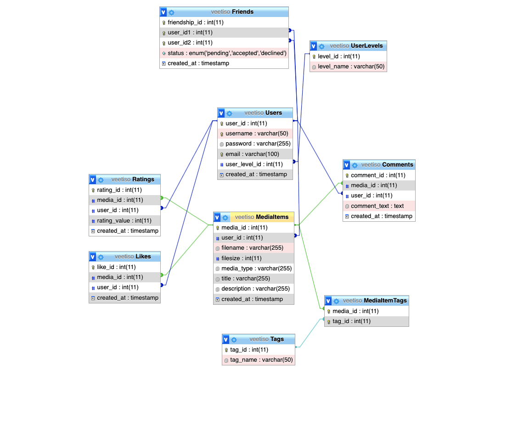

# Hybrid yksilötehtävä frontend repository

## Link to my app
[Link to app](https://users.metropolia.fi/~veetiso/vuosi3/hybrid/hybrid-yksilotehtava/)

## Link to backend repo
[Link to backend github repository](https://github.com/Vege25/hybrid-servers)

## Link to apidocs
[Link to apidoc](https://hybrid-server.northeurope.cloudapp.azure.com/upload/docs/index.html)

## App idea
- Share Productivity with friends and others by posting a daily productive media
## Features in the app:
- Add friends
- Accept friend requests
- View Friends and pending friend requests
- View users posts
- View your profile
- Log in
- Register
- Post your own productivity post
- Like a post
- Add a comment to a post
- View comments on a post
- Log out

## Tietokannan kuvaus

## Screenshots
### Profile page small screen

### Profile page larger screen

### Home page

### Friends page

### Upload posting page

